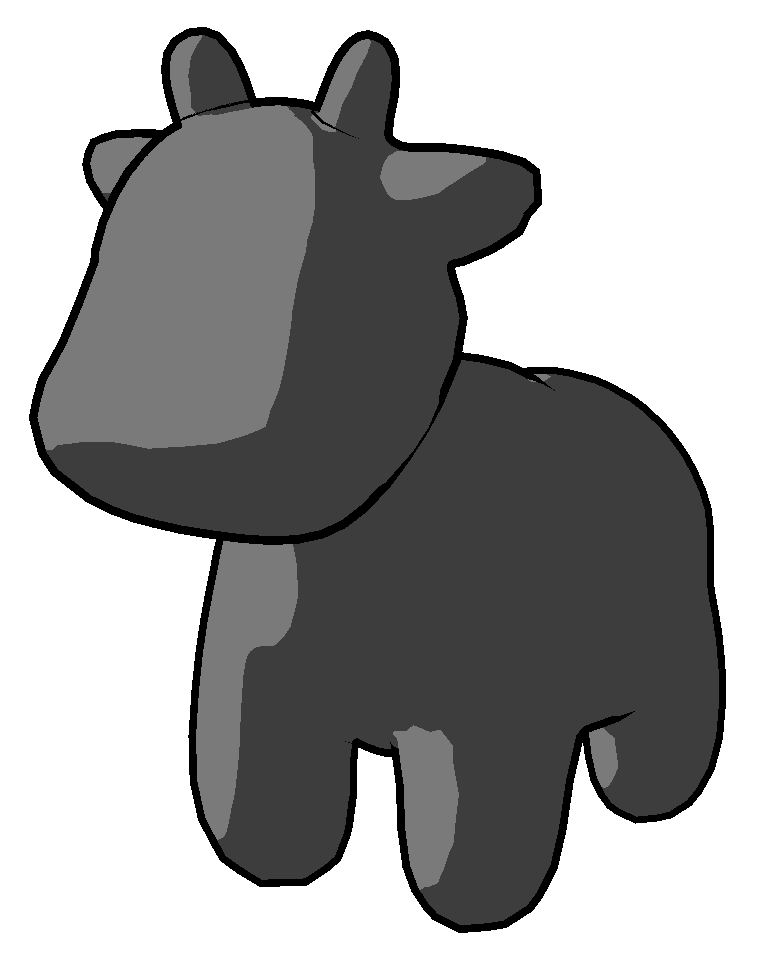
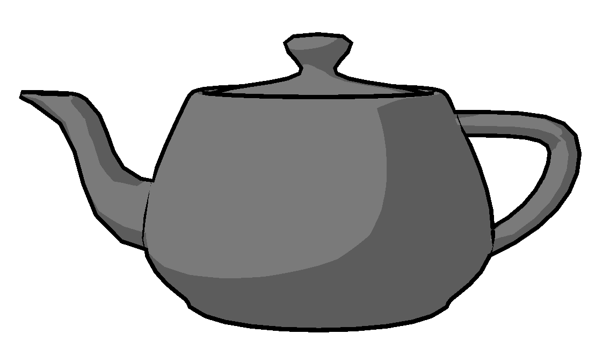
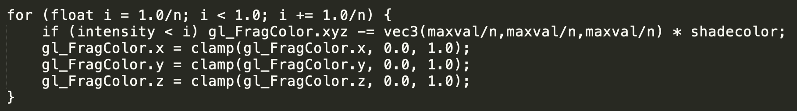
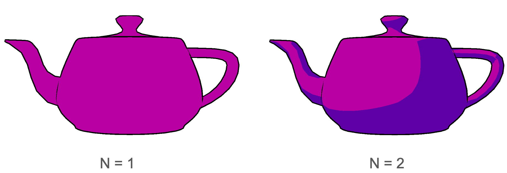
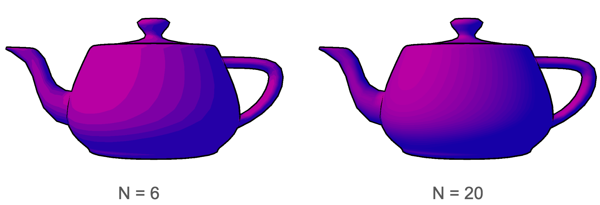
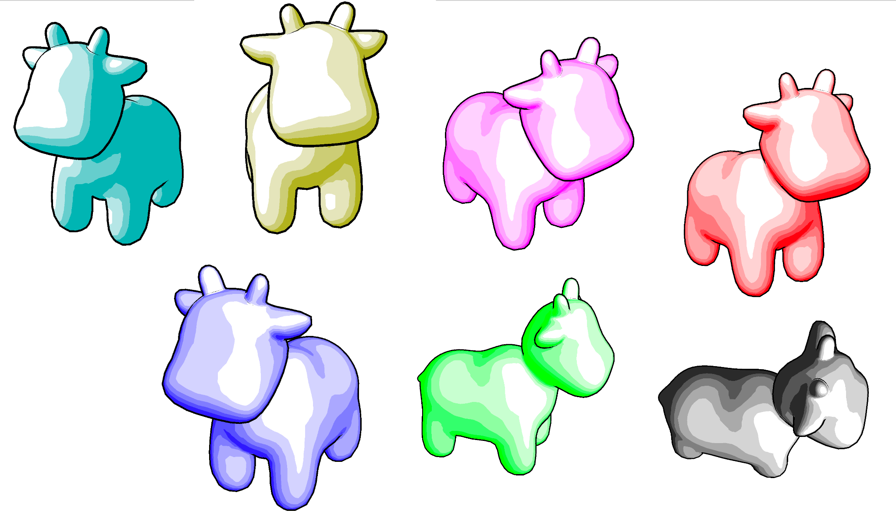
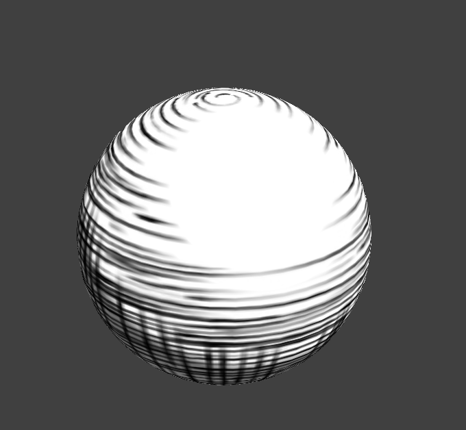
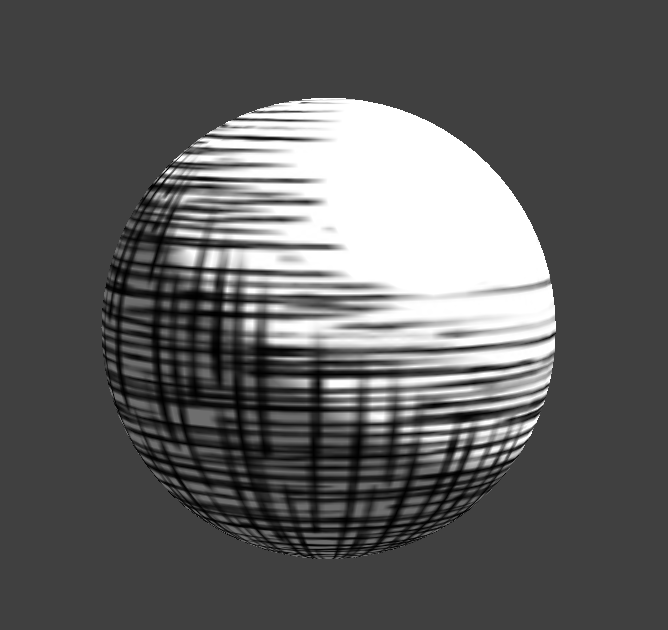
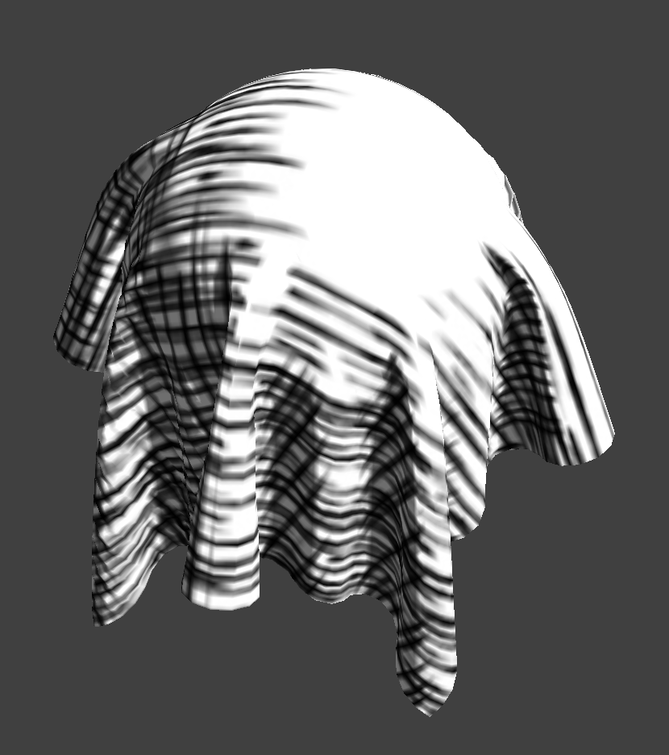

# Final Report

## Team
- Turese Anderson
- Gefen Kohavi
- Shannon Shih

## Summary

Our project started as a cel shader, but expanded to include all different sorts of artistic rendering techniques. We implemented the cel shading style, primarily, which involves one or more layers of blocky shadows and possibly highlights, as well as thick outlines around our rendered models, in a way that emulates cartoony 2D rendering. We also implemented texture mapping and material handling for the DAE 3D model files we worked with, so we could render the characters more completely. We also implemented interactive components to our GUI, allowing users to move the camera around, change the color of the cel shading shadows, and also adjust the amount of shadow "layers" in a cel shaded image themselves, to see which one looks the best for a certain model.

## Features

### Outlines

### Cel Shading

The cel shading itself was done very simply. We calculated the `intensity` of the light on each pixel of the mesh in a range from 0 to 1 by calculating the dot product of the normalized light direction with the normalized normal of the surface of the mesh at a particular pixel. If the `intensity` is 1, then that means the light direction is perpendicular to the mesh and the light would be at its brightest, while if the face is facing 'away' from the light source, the intensity will be closer to 0. If you set all intensities below a certain threshold to a darker color (in our case, 0.5 is a good baseline), then you can make cell shading that looks like the examples below.

### N-Level Shading and

To achieve N-Level shading, we expanded upon our cel shading algorithm to interpolate between the values of the shadow's color and the color of the model.

As you can see above, we did this by adding the shadow (represented by `shadecolor`) to `gl_FragColor`, which is the color of the pixel that we are shading. As i takes n steps to move up, a wider range of intensities is eligible to be shaded each iteration of the loop by subtracting the (inverse of the) shadow color. `maxval` represents the maximum value of the shadow's colors. For example, if `shadecolor = - vec3(0.5, 0.4, 0.3)`, then `maxval` will be 0.5.

For example, when N = 2, then the loop will only have 1 iteration, for `i = 1/2`, and every pixel with intensity less than 0.5 will be shaded once by 1/2 the shadow color, leading to one block of shadow, and 2 total 'layers' on the image.

When N = 4, then the loop will have 3 iterations, for `i = 1/4`, `i = 2/4`, and `i = 3/4`. where every pixel with intensity less than 0.25 will be shaded once, then every pixel with intensity less than 0.5 will be shaded once, and then 0.75. This makes it so the pixels with less 0.25 intensity will be shaded 3 times, and the pixels with less than 0.5 intensity will be shaded twice, creating distinct layers, where the bottom most is closest to the shadow color. This image will have 3 layers of shadow, and thus 4 total layers.

This creates an effect in images like those seen below.

### Different Colored Shadows

We also added the ability to shade with one of multiple different colors of shadows, chosen from a predefined set. These colors are chosen by hotkeys in the GUI, and shaded with by changing the value of the `shadecolor` variable in the shader.

### Texture Mapping

### Material Colors and rendering multiple objects at once.

To handle material colors in our project, we first had to handle importing them from the DAE file. Thankfully we had a premade file, `collada.cpp`, that did just that. This file passed along the information from the DAE file to the shaders by use of the `glUniform3fv`, making sure the shader had access to the diffuse, ambient, and specular color from the mesh object containing the information parsed from the DAE file, and then in the shaders, if the passed in boolean value that tells the shader when to use the uv texture coordinate as the color of the pixel and when to use the texture's diffuse color is set to diffuse, then the base color of the pixels of the object are set to the diffuse color of that object.

To get multiple objects to appear on screen, we... <INFO NEEDED>

### Blinn-Phong Shading

### Cross-Hatch Shading

We also implement cross-hatch shading where the shading style looks like it was drawn with a pen or pencil. We implemented this in project 4 since it easily had support for mutli-texture shading. To implement, we followed the paper "Real-Time Hatching" (http://hhoppe.com/hatching.pdf). This paper mainly forcuses on using multi-scale tonal art maps (TAM) and interpolates between them in multiple interesting ways to maintain consistency. Tonal art maps were extracted from <insert source>.

### Interactivity

Most interactivity in our app is done through the use of hotkeys. We extended the project 2 starter code's functionality for this part, taking the `meshEdit.cpp` function `void MeshEdit::key_event( char key )` and adding extra cases for the extra key functionalities. For keyboard events, this function is called, and depending on the input key, the switch statement calls a different handler to perform each action. The numbers 0-9 call different shaders (blinn phong vs diffuse, different shadow colors), the + and - buttons adjust the N level of shading, and the t button enables and disables textures if available.

We also made some minor adjustments to the camera, it can move left and right and up and down (from the original camera perspective only) with use of the WASD keys.

## References

## Team Member Contributions

- Turese Anderson: Contributed multi-level shading, multiple shadow colors, material colors, and some interactivity.
- Gefen Kohavi: Primarily worked on cross-hatch and other multi-texture shading. Shader debugging for project 2 starter code.
- Shannon Shih
