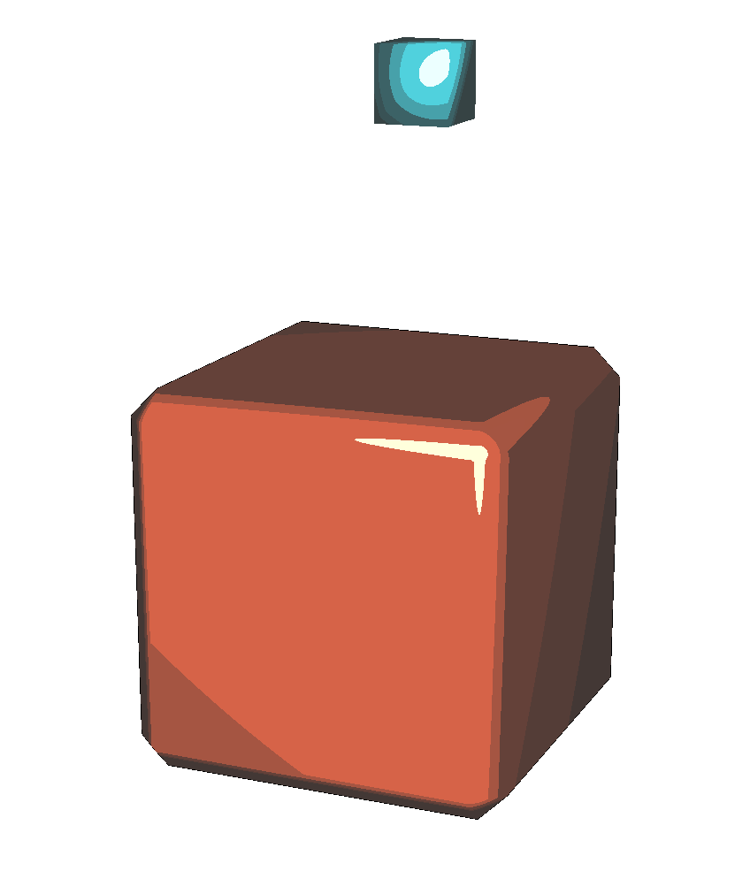

# Final Report

## Team
- Turese Anderson
- Gefen Kohavi
- Shannon Shih

## Summary

Our project started as a cel shader, but expanded to include all different sorts of artistic rendering techniques. We primarily implemented the cel shading style, which involves one or more layers of blocky shadows and highlights, as well as thick outlines drawn around our rendered models in a way that emulates cartoony 2D drawings. We also implemented texture mapping and material handling for the DAE 3D model files we worked with, so we could render the characters more completely. We also implemented interactive components to our GUI, allowing users to move the camera around, change the color of the cel shading shadows, and also adjust the amount of shadow "layers" in a cel shaded image themselves, to see which one looks the best for a certain model.

|  Hotkeys | Function  | 
| ---------|---------- | 
|<kbd>1</kbd>|Cel shading + Blinn Phong Shading |
|<kbd>2</kbd>|Diffuse Shading (red)|
|<kbd>3</kbd>|Diffuse Shading (yellow)|
|<kbd>4</kbd>|Diffuse Shading (green)|
|<kbd>5</kbd>|Diffuse Shading (teal)|
|<kbd>6</kbd>|Diffuse Shading (blue)|
|<kbd>7</kbd>|Diffuse Shading (hot pink)|
|<kbd>8</kbd>|Diffuse Shading (gray)|
|<kbd>9</kbd>|Diffuse Shading (black)|
|<kbd>W</kbd><kbd>A</kbd><kbd>S</kbd><kbd>D</kbd>|Move Camera|
|<kbd>T</kbd>|Toggle Textures|
|<kbd>+</kbd>|Add Shadow Layer (diffuse)|
|<kbd>-</kbd>|Remove Shadow Layer (diffuse)|

See section below for additional configuration settings

## Technical Approach and Results

### Outlines

One problem with cel shading is that its large blocky colors can make objects look flat so that it is hard to distinguish their shape and other features. One solution artists use is to draw outlines, which we have implemented here. To draw the outline, we initially tried just taking the dot product between the camera and the normal, and if the angle between the camera and the normal was close to perpendicular, we would render the fragment as black. However, this turned out to not work so well because the cases where this was true was too rare to draw a consistent outline. 

Instead, we used a method suggested by this [website](https://medium.com/@joshmarinacci/cartoon-outline-effect-6c4e95545537), which involves enlarging the mesh along the normal direction, culling the front faces, and coloring the mesh black. This resulted in a much more consistent outline. 

 |   |   | 
| -----------------------|-------------------------- | 
| Cow outline | Teapot outline | 

As a side note, we did find and consider other methods to draw outlines, including converting thee render to a texture and running an edge detection kernel over it to determine where the outlines were. However, we decided that the other methods were too difficult to implement due to our inexperience with OpenGL and GLSL. And as you will find out below, textures by themselves are hard enough to work with, so avoiding this method was probably the right decision.

### Cel Shading and Blinn-Phong Shading

The cel shading itself was done very simply. We calculated the `intensity` of the light on each pixel of the mesh in a range from 0 to 1 by calculating the dot product of the normalized light direction with the normalized normal of the surface of the mesh at a particular pixel. If the `intensity` is 1, then that means the light direction is perpendicular to the mesh and the light would be at its brightest, while if the face is facing 'away' from the light source, the intensity will be closer to 0. If you set all intensities below a certain threshold to a darker color (in our case, 0.5 is a good baseline), then you can make cell shading that looks like the examples below.

 |   |   | 
| -----------------------|-------------------------- | 
| Cel shaded dragon | Cel shaded teapot | 

### N-Level Shading and

To achieve N-Level shading, we expanded upon our cel shading algorithm to interpolate between the values of the shadow's color and the color of the model.

As you can see above, we did this by adding the shadow (represented by `shadecolor`) to `gl_FragColor`, which is the color of the pixel that we are shading. As i takes n steps to move up, a wider range of intensities is eligible to be shaded each iteration of the loop by subtracting the (inverse of the) shadow color. `maxval` represents the maximum value of the shadow's colors. For example, if `shadecolor = - vec3(0.5, 0.4, 0.3)`, then `maxval` will be 0.5.

For example, when N = 2, then the loop will only have 1 iteration, for `i = 1/2`, and every pixel with intensity less than 0.5 will be shaded once by 1/2 the shadow color, leading to one block of shadow, and 2 total 'layers' on the image.

When N = 4, then the loop will have 3 iterations, for `i = 1/4`, `i = 2/4`, and `i = 3/4`. where every pixel with intensity less than 0.25 will be shaded once, then every pixel with intensity less than 0.5 will be shaded once, and then 0.75. This makes it so the pixels with less 0.25 intensity will be shaded 3 times, and the pixels with less than 0.5 intensity will be shaded twice, creating distinct layers, where the bottom most is closest to the shadow color. This image will have 3 layers of shadow, and thus 4 total layers.

This creates an effect in images like those seen below.

 |

### Different Colored Shadows

We also added the ability to shade with one of multiple different colors of shadows, chosen from a predefined set. These colors are chosen by hotkeys in the GUI, and shaded with by changing the value of the `shadecolor` variable in the shader.

### Texture Mapping

After much difficulty, we implemented full support for mapping single textures onto a mesh using the UV coordinates provided in the DAE file. Our initial prototype converted vertex coordinates from 3D to 2D and used them as UV coordinates. While this did successfully display the texture on meshes but did not correctly map objects with prespecified textures like the shield and the Companion Cube.

However, Blender could somehow map the texture onto the object correctly, which indicated to us that the dae file came prespecified with UV coordinates that Blender knew how to map correctly to vertices. Attempts to directly correlate each vertex to a single UV coordinate failed spectacularly until TA James Fong gave us some suggestions, including using a debug texture with a plane so we could see what was wrong. By inspecting the much more simplified DAE file in combination with reading the [official specifications](https://www.khronos.org/files/collada_spec_1_4.pdf) for DAE files, we were able to quickly figure out the weird(ish) way DAE files represented UV coordinates and how they mapped to vertices (spoiler: they don't). We won't bore you with the details, but suffice to say UV coordinates can be mapped one-to-one with halfedges and using the halfedges we were able to flawlessly wrap the texture around the mesh.

We think the results speak for themselves:

 |

\*Meshes downloaded off the Internet. See below for credits.

### Material Colors

To handle material colors in our project, we first had to handle importing them from the DAE file. Thankfully we had a premade file, `collada.cpp`, that did just that. This file passed along the information from the DAE file to the shaders by use of the `glUniform3fv`, making sure the shader had access to the diffuse, ambient, and specular color from the mesh object containing the information parsed from the DAE file. This allows the shaders to set the base color of the object to the diffuse color of that object.

### Multi-mesh support

The default skeleton code for project 2 that we started with supported displaying multiple meshes. However, it didn't support *translating* those multiple meshes to their appropriate locations. We initially tried supporting fancier transformations like rotation and scaling, but this proved to be not compatible with the skeleton code, so we read in the coordinates for transformation from the DAE file and transformed each mesh in the DAE file by its prespecified value.

In combination with basic material support, we were able to display more complex, multi-colored objects like the Master Sword from the *Legend of Zelda* series.

### Cross-Hatch Shading

We also implement cross-hatch shading where the shading style looks like it was drawn with a pen or pencil. We implemented this in project 4 since it easily had support for mutli-texture shading. We followed the paper ["Real-Time Hatching"](http://hhoppe.com/hatching.pdf). This paper mainly forcuses on using multi-scale tonal art maps (TAM) and interpolates between them in multiple interesting ways to maintain consistency. For the purposes of our project, we decided to implement single-pass 5-way shading. To do this, we calculate the Blinn-Phong Shading of the object, we can then split this into multiple groups where the nunmber of groups is based on the number of tonal art maps. Once we figure out which group a certain coordinate belongs to, we can assign the color at group Gi to be `out_color.xyz` = mix(texn-i, texn-i-1, interp(I, i)) where I is the intensity and n is the number of textures. To interpolate, we subtract the intensity by the number of groups `n` times the size of the groups `L`, then we divide the result by the size of each group to get a value that is between zero and one. Tonal art maps were extracted from a [website](https://www.clicktorelease.com/code/cross-hatching/) that demos cross hatching.

|  |  |  |
| -----------------------|-------------------------- | -------------|
| Cross hatch shading sphere | Cross hatch shading sphere | Cross hatch shading sphere | 

|  | |
| -----------------------|-------------|
| Dot shading sphere | Abstract shading sphere | 

### Interactivity

Most interactivity in our app is done through the use of hotkeys. We extended the project 2 starter code's functionality for this part, taking the `meshEdit.cpp` function `void MeshEdit::key_event( char key )` and adding extra cases for the extra key functionalities. For keyboard events, this function is called, and depending on the input key, the switch statement calls a different handler to perform each action. The numbers 0-9 call different shaders (blinn phong vs diffuse, different shadow colors), the + and - buttons adjust the N level of shading, and the t button enables and disables textures if available.

We also made some minor adjustments to the camera, it can move left and right and up and down (from the original camera perspective only) with use of the WASD keys.

## References
[Outline tutorial](https://medium.com/@joshmarinacci/cartoon-outline-effect-6c4e95545537)

[Simple implementation of cel shading](https://pdfs.semanticscholar.org/d17c/efe2c199a87a2ee8e5dc82399a50a8e951c4.pdf)

[Official Collada specification](https://www.khronos.org/files/collada_spec_1_4.pdf)

[Hatching paper](http://hhoppe.com/hatching.pdf)

[Cross hatching demo](https://www.clicktorelease.com/code/cross-hatching/)

### 3D Model credits:

[Shield](https://sketchfab.com/3d-models/wooden-shield-the-legend-of-zelda-botw-2c34417be71c472f8da639c86322be9d)

[Companion cube](https://sketchfab.com/3d-models/companion-cube-lowmance-65b8fcbb3f7b4dbdadec7ad90ca48adc)

[Sea dragon](https://sketchfab.com/3d-models/dragon-ver2-81c90e3d51674d8493804a28d1255493)

[Master Sword](https://clara.io/view/c7521d40-22ff-4bdb-85da-67240f4dd357)

## Team Member Contributions

- Turese Anderson: Contributed multi-level shading, multiple shadow colors, material colors, and some interactivity.
- Gefen Kohavi: Primarily worked on cross-hatch and other multi-texture shading. Shader debugging for project 2 starter code.
- Shannon Shih: Wrote intial cel shading code, combined it with Blinn-Phong Shading, added outlines, implemented texture mapping, multi-mesh support, added support for displaying multiple meshes of different colors, created the winged dragon model, and converted all 3D models except cow and teapot into DAEs that were compatible with our code (not easy btw).
- Blender 2.72: The MVP of our group, could handle all the 3D models we threw at it and gave us the hint that there should be a way to map textures onto a model in a more reasonable fashion. 

## Running our code
Beyond the interactive components documented above, our code also support changing several settings. The most interactive (and non-interactive) settings can be changed in `p2-meshedit/src/meshEdit.h:235`. Here are some example configurations we used to display some of the images shown above. Command line argument paths are given assuming user is running Xcode, but really should be the relative path to the DAE file in question.

Teapot outline: 

|  Setting | Value  | 
| ---------|---------- | 
| Command line argument: | `./build ../../dae/teapot.dae` |
| `drawOutlines` | `true` |
| `nvalue` | `0.0` |
| `toggletex` | `false` |
| Keyboard button to press | <kbd>2</kbd> | 
| Output: |  |

Cel shaded teapot: 

|  Setting | Value  | 
| ---------|---------- | 
| Command line argument: | `./build ../../dae/teapot.dae` |
| `drawOutlines` | `true` |
| `nvalue` | `2.0` |
| `toggletex` | `false` |
| Keyboard button to press | <kbd>1</kbd> |
| Output: |  | 

Purple teapot: 

|  Setting | Value  | 
| ---------|---------- | 
| Command line argument: | `./build ../../dae/purpleteapot.dae` |
| `drawOutlines` | `true` |
| `nvalue` | `2.0` |
| `toggletex` | `false` |
| Keyboard button to press | <kbd>2</kbd>, plus <kbd>+</kbd> and <kbd>-</kbd> as appropriate | 
| Output: |  |

Colored cows: 

|  Setting | Value  | 
| ---------|---------- | 
| Command line argument: | `./build ../../dae/cow.dae` |
| `drawOutlines` | `true` |
| `nvalue` | `4.0` |
| `toggletex` | `false` |
| Keyboard button to press | <kbd>2-9</kbd> | 
| Output: |  |

Sea dragon: 

|  Setting | Value  | 
| ---------|---------- | 
| Command line argument: | `./build ../../dae/seadragon.dae` |
| `drawOutlines` | `false` |
| `nvalue` | `2.0` |
| `toggletex` | `true` |
| `texture_name` | `seadragon.png` |
| Keyboard button to press | <kbd>8</kbd> | 
| Output: |  |

Master Sword: 

|  Setting | Value  | 
| ---------|---------- | 
| Command line argument: | `./build ../../dae/mastersword.dae` |
| `drawOutlines` | `true` |
| `nvalue` | `2.0` |
| `toggletex` | `false` |
| Keyboard button to press | <kbd>1</kbd>, then zoom out | 
| Output: |  |
