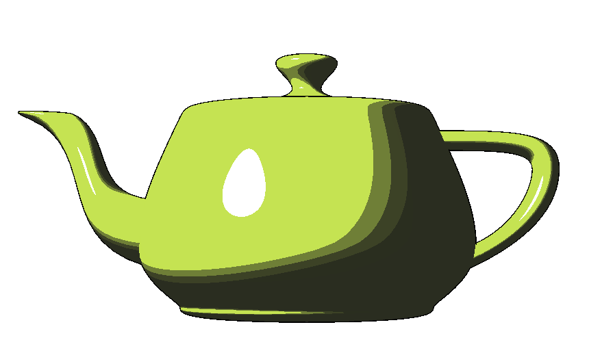
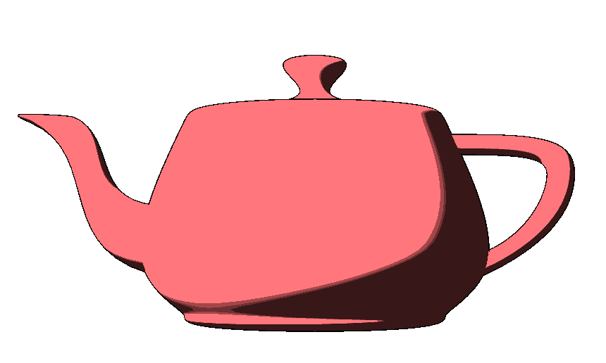
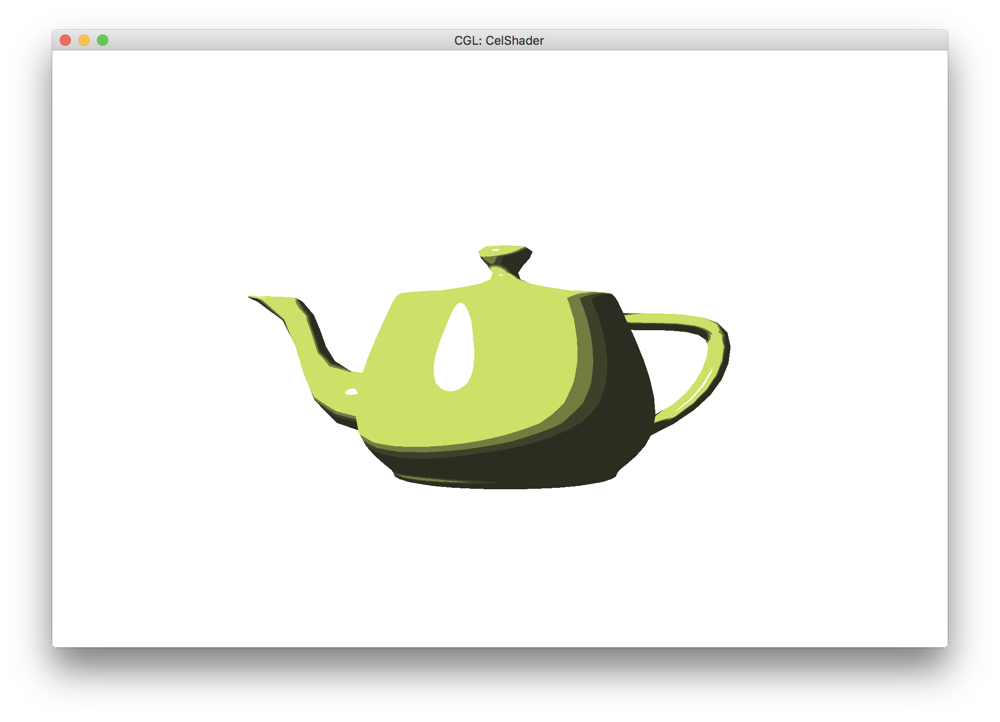
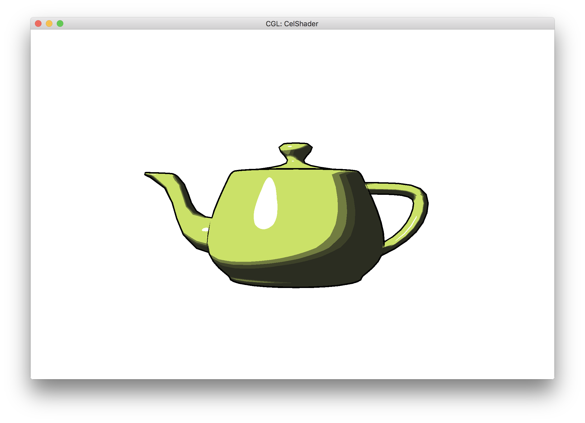
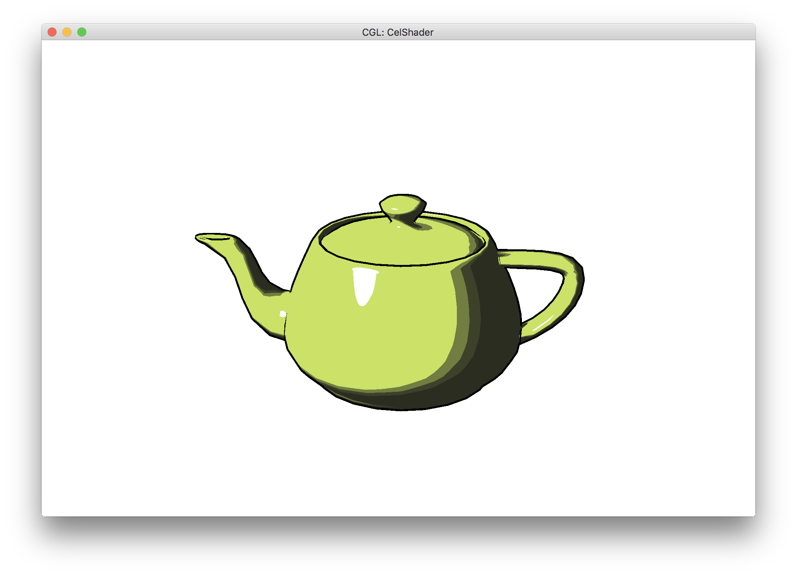

# Progress Report

**Video link:** 

**Slides**
[Slides here](https://docs.google.com/presentation/d/1koAZuEo0fWr01861KqCORCwR0_fiAw3VNkBIwQIoSpk/edit?usp=sharing)

## Finished tasks
So far we have implemented two styles of shading: Blinn Phong (has multiple layers of shadow and a highlight layer), and diffuse shading (multiple layers of shadow and no highlight). We have accomplished n level shading, as in n different layers of shadows can be added to the model, but this has to be done programatically, and the user cannot decide the levels of shadow themselves. 

We've also started implementing basic interactivity, with the ability to move the camera perspective up, down, left, and right in the project 2 GUI. It isn't fully compatible with the camera rotation in project 2 yet, however, as the axis of rotation hasn't changed from the former centroid of the model.

## Preliminary Results

As you can see, the cel shading looks pretty good, and the specular lighting changes as you move the camera, which models how light reflects off objects depending on viewpoint in real life. However, you'll notice that a lot of areas where parts of the teapot overlap look like the same color, which makes it hard to see the shape of the teapot.

Implementing outlines would fix this problem, so we implemented another shader that only drew the back faces of the object, scaled up the object in the direction of its vertices, and drew the scaled up object with the color of the outline. This results in a much cleaner outline that looks more realistic. 

 

## Progress Reflection

We originally planned to implement our project with starter code from Project 4 because it had support for shaders. However, when we found that it couldn't support dae files, we pivoted to Project 2 because it has support for shaders, which could be expanded upon for extra credit in the original project.

With Project 2 code, we were able to implement cel shading pretty easily. What was surprising was that Blinn-Phong shading was also pre-implemented so it was a simple matter of augmenting the code to do cel shading with ambient, diffuse, and specular lighting.

Implementing outlines was a bit harder because we were unfamiliar with OpenGL/GLSL and the OpenGL version used in Project 2 is older than the version used in Project 4, where we had initially learned some GLSL.

Textures and interactivity turned out to be more complicated to implement than we initially thought. But despite these complications, we are still on track with the schedule we initially laid out in our proposal. 

## Updated Plan

Although we were told that we might finish our main goals with enough time to finish all of our stretch goals, we think we will not be able to finish all of our stretch goals before the end of the project. However, we should be able to finish all of our main goals along with one or two stretch goals. Our updated schedule is below:

Week 3

* Finish implementing texture mapping
* Start implementing cross hatching

Week 4

* Finish implementing cross hatching
* Finish implementing interactivity
* If we still have time, implement techniques listed under Stretch Goals

