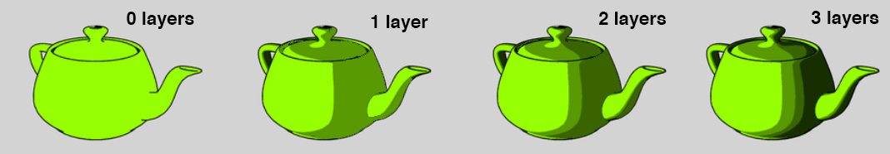

## Team
- Turese Anderson
- Gefen Kohavi
- Shannon Shih

# Summary
The goal of thisi project will be to render images with an artistic shading style known as cel shading, or toon shading. We will implement additional effects like outlines and textures to artistically enhance the images we generate. Cel shading renders objects with large, blocky shadows and dark outlines reminiscent of the hard outlines of 2D drawn cartoon images. Some well known examples of cel shading in 3D are &The Legend of Zelda: The Wind Waker& and *The Legend of Zelda: Breath of the Wild*.

# Problem Description
A lot of work has been done to replicate realistic scenes. However, from an artistic and practical point of view it is sometimes more advantageous to render a stylized scene so that it appears hand drawn. Cel shading specifically mimics the way hand drawn animations appear, with abrupt changes in lighting and mono color areas. In addition, cel shading can make objects appear excessively flat and unappealing, so additional tricks like drawing outlines and adding texture mapping are needed to make the images look more artistic. Since cel shading is also designed to render quickly, we will also implement an interactive demo that would allow the user to move around a 3D scene, which will also demonstrate that our rendering can be done in real time.

Challenges that we might run into are creating the cel shading texture maps for each object we render, adjusting the shading technique for different types of materials (ex: specular vs. diffuse), optimizing our rendering code to run in real time, and making our images look good. We can solve some of these challenges by using pre-made dae files and their cel shading textures obtained from the Internet and implementing additional effects like texture mapping and outlines.

# Goals
## Main
Our main goal is to have a basic interactive cel shader with outlines and textures done by the end of the project. The user should be able to move around a 3D scene in real time and the shading should change in real time if the lighting changes or moves. To evaluate the quality of our rendering, we will check to see whether the colors appear smooth, whether the rendering is fast enough, and whether the image "looks good". We will also compare our images against other cel-shaded images such as the ones below to see if our implementation is accurate. We can also use Blender to render models with cel shading and compare our results to Blender's.

Corresponding [dae file](https://www.models-resource.com/wii_u/supersmashbrosforwiiu/model/9293/)

We also plan to analyze the rendering times of our shader. How fast or slow is cel shading compared to ray tracing? How do the images compare to soft shaded renderings of the same models? Does the interactive demo run in real time even if the view/lighting changes quickly?

## Stretch
Some strech goals we have in mind is to implement alternate shading techniques such as cross hatching, rendering [water](http://graphics.berkeley.edu/papers/Eden-AMF-2007-05/Eden-AMF-2007-05.pdf) with cel shading (with downloaded code/pre-rendered fluid simulation), add a GUI option to separate "layers" shading like shown below, and implement screen space reflections to approximate global illumination from ray tracing.

# Schedule

Week 1
- Create a design doc outlining how to implement all rendering techniques listed in our goals (cel shading, outlines, texture mapping)
- Start implementing cel shading
- Start implementing outlines
Week 2
- Finish implementing cel shading 
- Finish implementing outlines
Week 3
- Implement texture mapping
- Implement interactivity
Week 4
- Finish texture mapping
- Finish implementing interactivity
- If we still have time, implement techniques listed under Stretch Goals

# Resources
- We will use [this](https://en.m.wikibooks.org/wiki/GLSL_Programming/Unity/Toon_Shading) as a guide for how to implement cel shading 
- For starter code, we will start with the shader implemented in Project 4, part 5	
- [Advanced Real-Time Cel Shading Techniques in OpenGL](https://www.cs.rpi.edu/~cutler/classes/advancedgraphics/S12/final_projects/hutchins_kim.pdf)
- More in depth [research](https://raulreyesfinalproject.files.wordpress.com/2012/12/dissertation_cell-shading-raul_reyes_luque.pdf) into cel shading
- Textbook [chapter](http://www.chrille.maps4vips.info/Archiv/FIN/NZ/COMPSCI715/Project/Tutorial.html) on cel shading
- Simple [implementation](https://pdfs.semanticscholar.org/d17c/efe2c199a87a2ee8e5dc82399a50a8e951c4.pdf) of cel shading
- Real time [cross hatching](http://hhoppe.com/hatching.pdf)
- Image [quilting](https://people.eecs.berkeley.edu/~efros/research/quilting/quilting.pdf) for textures
- [Fluid simulation with cel shading](http://graphics.berkeley.edu/papers/Eden-AMF-2007-05/Eden-AMF-2007-05.pdf)
